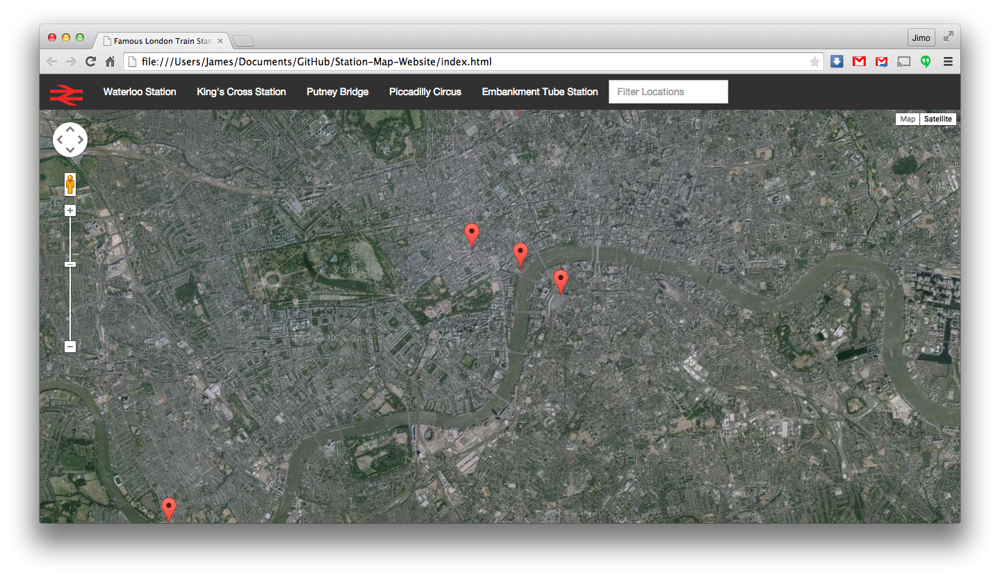

# Station Map Webpage
Pulls in data from both the Wikipedia and Google Maps API and displays it using KnockoutJS declarative bindings.

## Getting Started
* Open "index.html" with a web browser. You'll need to ensure that you have scripts enabled for everything to function properly.

